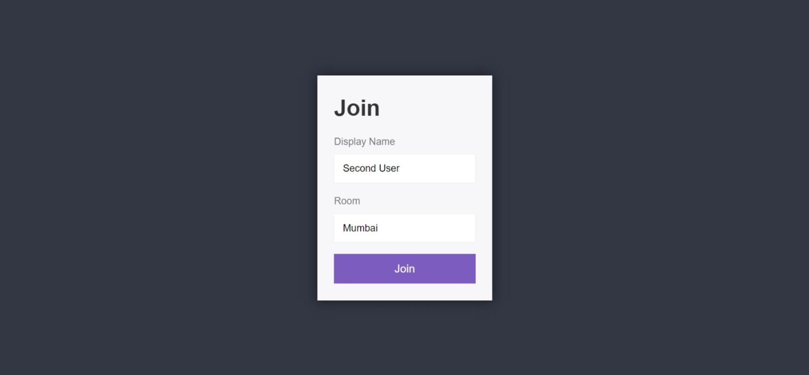
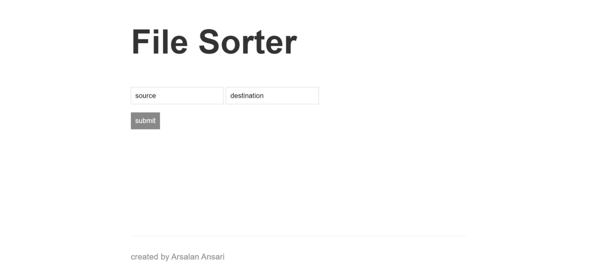
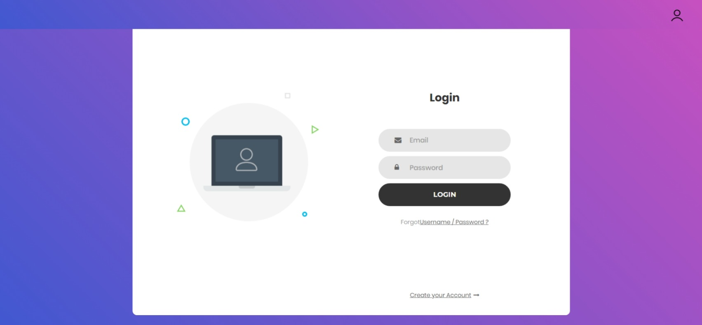
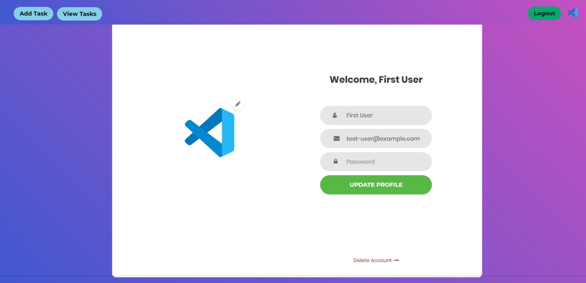
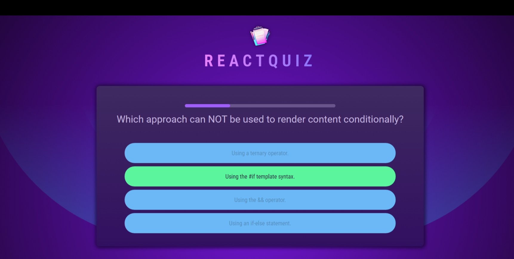
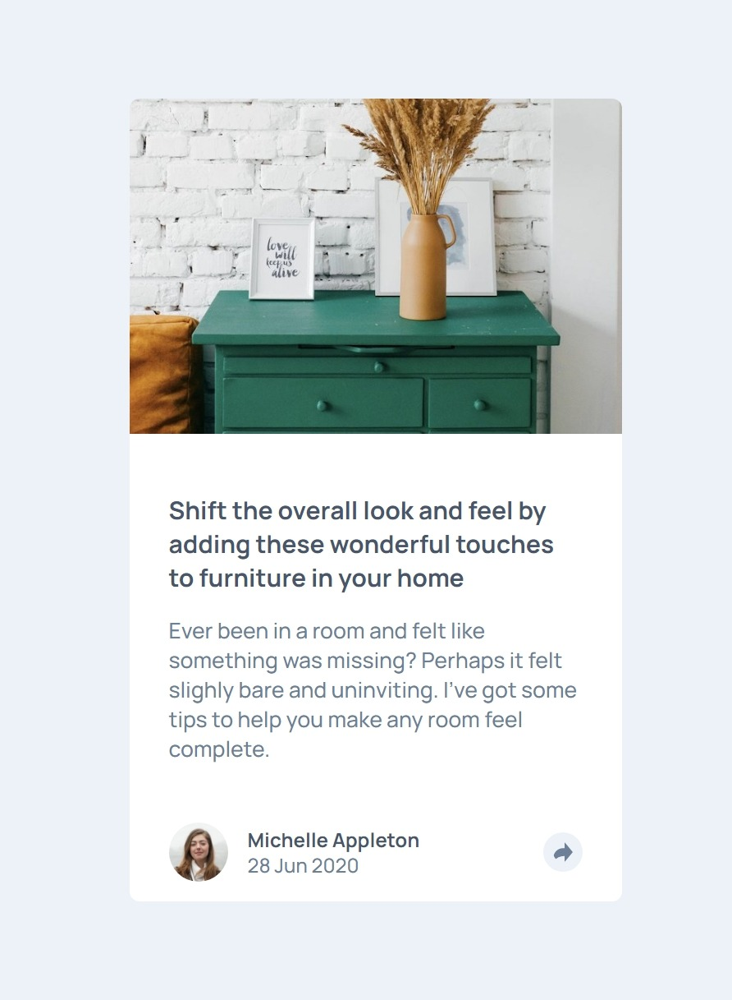
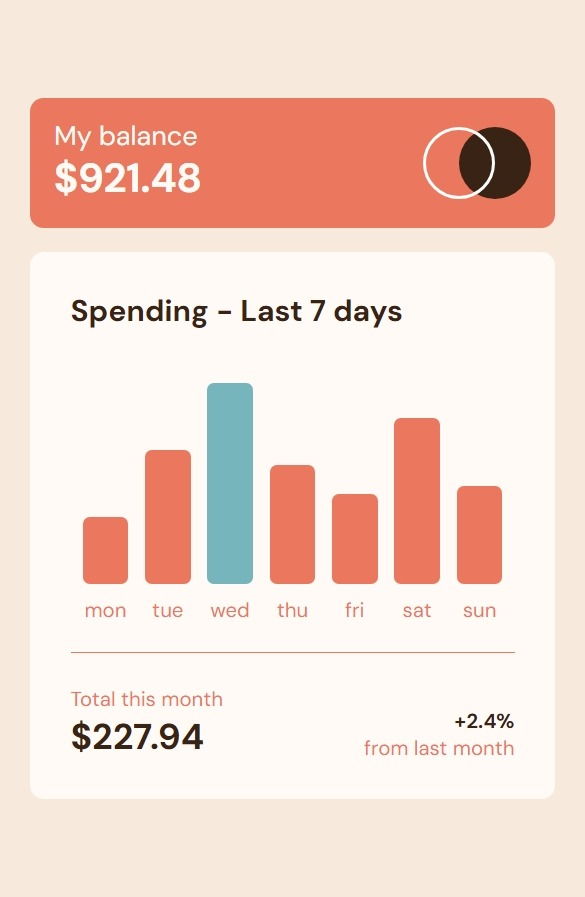
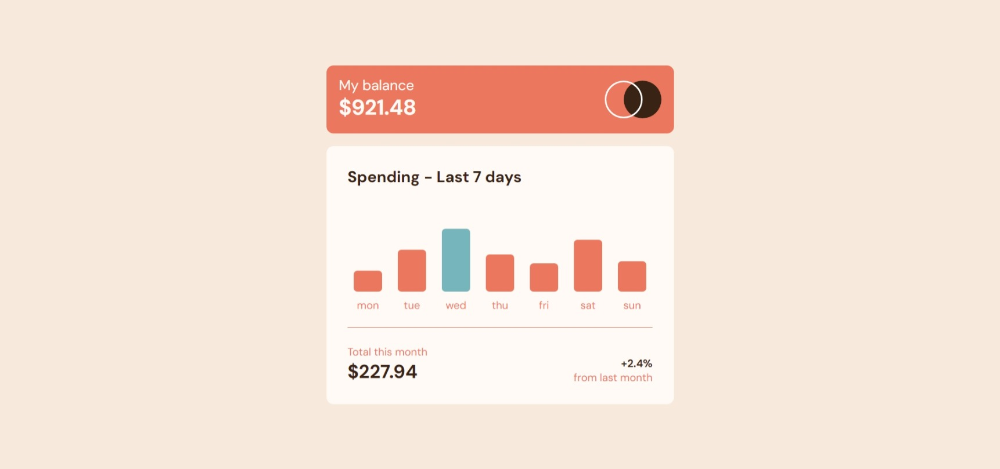
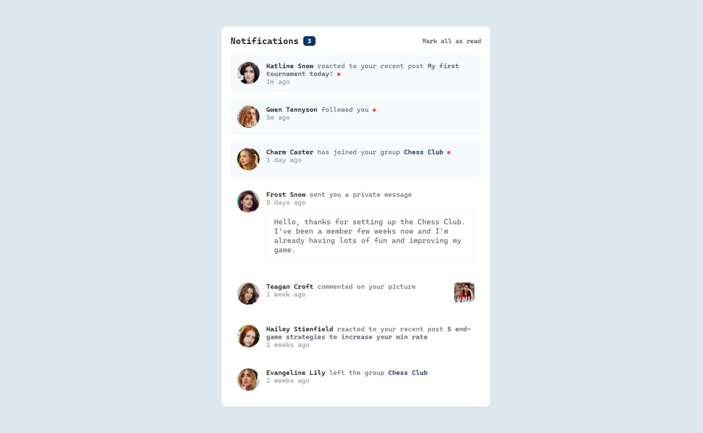
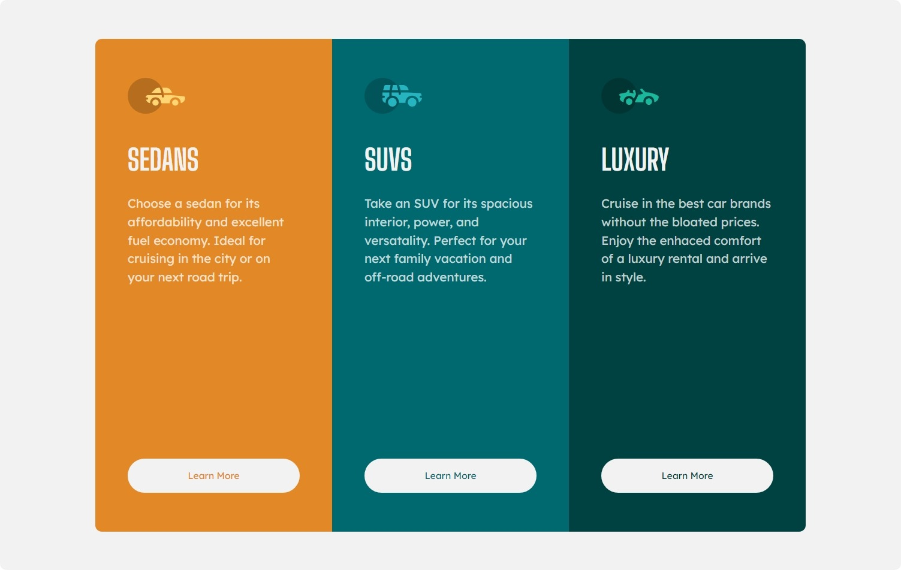

# 👋, Arsalan Ansari Here

### 💻 Tech Stack

### 💻 Developed Projects

1. ## Chat Application

   ### Project based on Node.js, it provides real time server for multiple users to chat with each other.

   Screens  
   
   
   

2. ## Expense Tracker

   ### Project based on React.js, just a simple application works in a local environment which can track expense information based on the date in a specific year.

   Screens  
   
   
   

3. ## File Sorter

   ### Project based on Node.js, it sorts and groups the files inside a folder according to the date and month of file in which it was created or taken.

   Screens  
   

4. ## Tic Tac Toe

   ### Project based on React.js & Typescript, lets users play Tic Tac Toe.

   Screens  
   
   
   

5. ## Task Manger App

   ### Project based on React.js, it allows users to create tasks.

   Screens  
   
   
   
   

6. ## Quiz App

   ### Project based on React.js, just a basic quiz application.

   Screens  
   
   

7. ## Movie App

   ### Project based on React.js, it allow users to find latest movie release.

   Screens  
   

8. ## Food Pantry

   ### Project based on React.js, a simple cart application which lets you add food displayed in the list to the shopping cart.

   Screens  
   
   
   

9. ## Consultation App

    ### Project based on React.js & Typescript, it lets users to consult with the doctors available.

    Screens  
    
    
    
    
    

10. ## [Age Calculator](https://arsalanansariofficial.github.io/age-calculator-page/)

    Screens  
    
    

11. ## [Article Preview](https://arsalanansariofficial.github.io/article-preview-page/)

    Screens  
    
    

12. ## [Base Home Page](https://arsalanansariofficial.github.io/base-home-page/)

    Screens  
    
    

13. ## [NFT Card](https://arsalanansariofficial.github.io/card-page/)

    Screens  
    
    

14. ## [Expense Chart](https://arsalanansariofficial.github.io/expense-chart-page/)

    Screens  
    
    

15. ## [Interactive Card Details](https://arsalanansariofficial.github.io/interactive-card-details-page/)

    Screens  
    
    

16. ## [Multistep Form](https://arsalanansariofficial.github.io/multip-step-form-page/)

    Screens  
    
    

17. ## [Newsletter](https://arsalanansariofficial.github.io/newsletter-page/)

    Screens  
    
    

18. ## [Notifications Page](https://arsalanansariofficial.github.io/notifications-page/)

    Screens  
    
    

19. ## [Order Summary Page](https://arsalanansariofficial.github.io/order-summary-page/)

    Screens  
    
    

20. ## [Ping Home Page](https://arsalanansariofficial.github.io/ping-home-page/)

    Screens  
    
    

21. ## [Product Page](https://arsalanansariofficial.github.io/product-page/)

    Screens  
    
    

22. ## [Profile Card Page](https://arsalanansariofficial.github.io/profile-card-page/)

    Screens  
    
    

23. ## [Qr Page](https://arsalanansariofficial.github.io/qr-page/)

    Screens  
    
    

24. ## [Rating Page](https://arsalanansariofficial.github.io/rating-page/)

    Screens  
    
    

25. ## [Recipe Page](https://arsalanansariofficial.github.io/recipe-page/)

    Screens  
    
    

26. ## [Stats Preview Page](https://arsalanansariofficial.github.io/stats-preview-card-page/)

    Screens  
    
    

27. ## [Summary Page](https://arsalanansariofficial.github.io/summary-page/)

    Screens  
    
    

28. ## [3 Column Preview Page](https://arsalanansariofficial.github.io/three-column-preview-page/)

    Screens  
    
    
